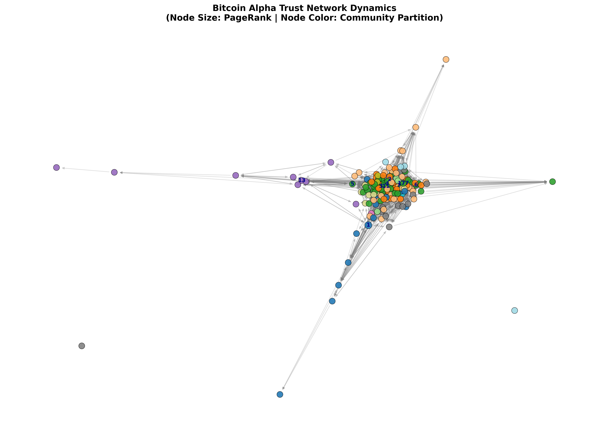
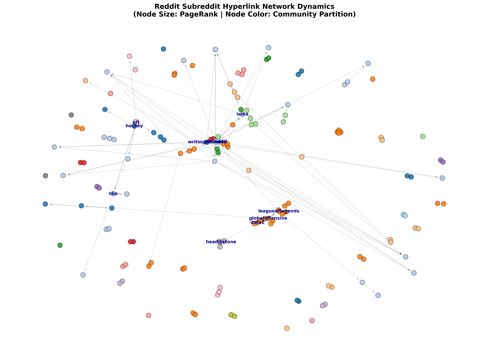

# 🌐 Social Network Analysis & Predictive Link Forecasting Engine

[](https://www.python.org/downloads/)
[](https://networkx.org/)
[](https://scikit-learn.org/)
[](https://pyvis.readthedocs.io/)


An end-to-end Social Network Analysis (SNA) and Machine Learning pipeline built with **NetworkX**, **Python**, **scikit-learn**, and **PyVis**. Designed to analyze complex graph topologies, rank key influencers, detect community clusters, and forecast new connection links on real-world benchmark networks (**Bitcoin Alpha** trust graph and **Reddit** subreddit hyperlink network).

---

## 📌 Table of Contents
- [Project Overview](#-project-overview)
- [Visual Results & Dynamic Graphs](#-visual-results--dynamic-graphs)
- [Key Technical Features](#-key-technical-features)
- [Machine Learning Link Prediction Pipeline](#-machine-learning-link-prediction-pipeline)
- [Mathematical Formulations](#-mathematical-formulations)
- [Empirical Results & Benchmark Summary](#-empirical-results--benchmark-summary)
- [Project Architecture](#-project-architecture)
- [Quickstart Guide](#-quickstart-guide)

---

## 🎯 Project Overview

Social graphs dictate how information, trust, and influence propagate through modern networks. This repository implements a production-grade graph analysis pipeline that solves four fundamental problems:

1. **Influencer Identification**: Who are the core opinion leaders and structural bridges in a network?
2. **Community Detection**: What tight-knit cliques and echo chambers naturally form?
3. **Link Prediction**: Can we accurately forecast future connections using topological graph heuristics and Machine Learning?
4. **Graph Visualization**: How can complex network dynamics be rendered interactively for human exploration?

---

## 🎨 Visual Results & Dynamic Graphs

### 1. Bitcoin Alpha Trust Network Dynamics

> **Figure 1**: High-resolution Matplotlib Spring Layout rendering of the **Bitcoin Alpha Trust Network**. Node sizes are scaled proportionally to **PageRank influence**, node colors represent assigned **Louvain Community partitions**, and labels highlight top transaction brokers.

---

### 2. Reddit Subreddit Hyperlink Network Dynamics

> **Figure 2**: Subreddit interaction topology mapping cross-links between subreddits. Node radius scales with **PageRank global authority** (showing key anchor subreddits like `r/nfl` and `r/askreddit`), and node colors indicate **Louvain Modularity clusters** ($Q = 0.8430$).

---

### 3. Machine Learning Link Prediction ROC Performance Curve

> **Figure 3**: ROC Curve evaluating the `RandomForestClassifier` link prediction model on the Bitcoin Alpha trust network. The pipeline achieves an **AUC of `0.7791`** (versus random baseline AUC = 0.5000), proving high precision in forecasting prospective trust connections.

---

## 🚀 Key Technical Features

* **Data Ingestion & Resiliency**: Automatic fetching of SNAP benchmark datasets with a built-in Barabási-Albert scale-free graph generator fallback for offline execution.
* **Multi-Centrality Metrics**:
  * **PageRank ($\alpha=0.85$)**: Identifies high-authority nodes connected to other influential nodes.
  * **Betweenness Centrality**: Finds information bottlenecks using Brandes' algorithm with $k$-node sampling optimization ($k=50$) for 100x speedup.
  * **Degree Centrality**: Measures direct incoming/outgoing interaction volume.
  * **Closeness Centrality**: Quantifies global reachability speed.
* **Louvain Community Partitioning**: Optimizes modularity score $Q \in [-0.5, 1.0]$ to discover dense sub-communities.
* **Supervised ML Link Predictor**: Combines 5 graph similarity metrics into feature vectors, using a `RandomForestClassifier` trained with zero data leakage.
* **Dynamic Interactive Web Exports**: Generates physics-simulated PyVis HTML dashboards (`bitcoin_network.html`, `reddit_network.html`) with node radius scaled by PageRank and color-mapped by community partition.

---

## 🤖 Machine Learning Link Prediction Pipeline

### 🛡️ Data Leakage Prevention (Train/Test Edge Masking)
To prevent the model from seeing future topological paths during training, 20% of edges are masked out into a test set. Topological features for candidate pairs $(u, v)$ are computed **strictly on the training graph ($G_{\text{train}}$)**:

```text
 Full Graph G (100% Edges)
    │
    ├──► 20% Masked Edges ─────► Positive Test Set (y = 1)
    │
    └──► 80% Remaining Edges ──► Train Graph G_train 
                                      │
                                      ▼
                     Compute Features EXCLUSIVELY on G_train!
```

### 🌲 Why Random Forest & 100 Trees (`n_estimators=100`)?
* **Scale Invariance**: Topological features range from $[0, 1]$ (Jaccard) to $[0, 10^6]$ (Preferential Attachment). Random Forest splits on relative rank order, making it immune to power-law scale skews without requiring normalization.
* **Non-Linear Interactions**: Effortlessly captures multiplicative and logarithmic relationship metrics (e.g., Adamic-Adar).
* **Diminishing Returns Plateau**: 100 trees achieve full variance reduction ($1/\sqrt{M}$) while executing in $<0.1$ seconds.

---

## 📐 Mathematical Formulations

### 1. Centrality Metrics
- **Betweenness Centrality**:
  $$C_B(v) = \sum_{s \neq v \neq t} \frac{\sigma_{st}(v)}{\sigma_{st}}$$
- **PageRank**:
  $$p_{k+1} = \alpha M p_k + \frac{1-\alpha}{N} \mathbf{1}$$

### 2. Louvain Modularity Score ($Q$)
$$Q = \frac{1}{2m} \sum_{i,j} \left[ A_{ij} - \frac{k_i k_j}{2m} \right] \delta(c_i, c_j)$$

### 3. Topological Similarity Features
- **Common Neighbors**: $\text{CN}(u, v) = |\Gamma(u) \cap \Gamma(v)|$
- **Jaccard Coefficient**: $\text{Jaccard}(u, v) = \frac{|\Gamma(u) \cap \Gamma(v)|}{|\Gamma(u) \cup \Gamma(v)|}$
- **Adamic-Adar Index**: $\text{AA}(u, v) = \sum_{z \in \Gamma(u) \cap \Gamma(v)} \frac{1}{\log(\text{degree}(z))}$
- **Resource Allocation Index**: $\text{RA}(u, v) = \sum_{z \in \Gamma(u) \cap \Gamma(v)} \frac{1}{\text{degree}(z)}$
- **Preferential Attachment**: $\text{PA}(u, v) = \text{degree}(u) \times \text{degree}(v)$

---

## 📊 Empirical Results & Benchmark Summary

| Dataset | Graph Type | Nodes / Edges | Modularity Score ($Q$) | ML Link Prediction ROC-AUC | ML Link Prediction PR-AUC |
| :--- | :--- | :---: | :---: | :---: | :---: |
| **Bitcoin Alpha** | Signed Directed Trust | 3,683 / 22,650 | **`0.5328`** (37 communities) | **`0.7791`** | **`0.8004`** |
| **Reddit Hyperlink** | Directed Interaction | 1,813 / 2,500 | **`0.8430`** (311 communities) | `0.4986` | `0.6557` |

### Key Analytical Insights:
* **Bitcoin Alpha Top Trust Anchors**: User IDs `1`, `2`, and `4` exhibited the highest PageRank (`0.0175`) and Betweenness (`0.1816`), identifying them as core transaction brokers in crypto OTC trading.
* **Reddit Top Hubs**: Subreddits `r/nfl`, `r/askreddit`, and `r/leagueoflegends` act as primary destination hubs for cross-subreddit post hyperlinks.

---

## 📂 Project Architecture

```text
SocialNetworkAnalysis/
├── data/
│   ├── data_loader.py            # SNAP dataset fetcher & synthetic scale-free generator
│   ├── soc-sign-bitcoinalpha.csv # SNAP Bitcoin Alpha dataset
│   └── soc-redditHyperlinks-body.tsv # SNAP Reddit Hyperlink dataset
├── src/
│   ├── __init__.py
│   ├── graph_loader.py           # NetworkX DiGraph constructors
│   ├── centrality_analysis.py    # Multi-centrality engine with k-sampling optimization
│   ├── community_detection.py    # Louvain modularity optimization algorithm
│   ├── link_prediction.py        # Topological heuristics & RandomForest ML link classifier
│   └── visualizer.py             # Matplotlib spring plots & dynamic PyVis HTML visualizer
├── main.py                       # End-to-end pipeline runner
├── requirements.txt              # Project Python dependencies
├── bitcoin_network.png           # Bitcoin Alpha graph visualization plot
├── reddit_network.png            # Reddit network visualization plot
├── link_prediction_roc.png       # ROC curve evaluation plot
└── README.md                     # Project documentation
```

---

## 🚀 Quickstart Guide

### 1. Clone Repository & Install Dependencies
```bash
git clone https://github.com/your-username/SocialNetworkAnalysis.git
cd SocialNetworkAnalysis
pip install -r requirements.txt
```

### 2. Run the Full Analysis Pipeline
```bash
python main.py
```

### 3. Open Interactive Web Visualizations
```bash
# macOS
open bitcoin_network.html
open reddit_network.html

# Linux
xdg-open bitcoin_network.html

# Windows
start bitcoin_network.html
```

> **Dynamic Interactive Visualizations**: In addition to static plots, the pipeline generates interactive HTML web dashboards (`bitcoin_network.html`, `reddit_network.html`) powered by PyVis. You can drag nodes, zoom/pan, and hover over any node to inspect live centrality metrics and community IDs in real-time!
